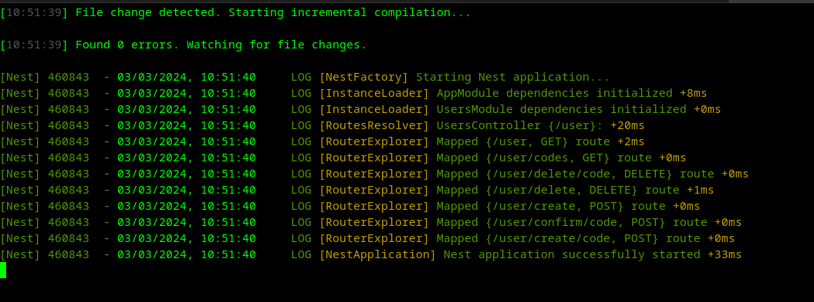

## Projeto LocalSig

<div style="text-align: center;">
     
</div>

### Estrutura de organização do projeto

#### Design no projeto

- [Figma](https://www.figma.com/file/tj7bawJssWetVo7Cik5TvF/Projeto-localsig?type=design&node-id=0%3A1&mode=design&t=w9nB8SzqUphxlbxC-1)

#### Check list do projeto

- [Trello](https://trello.com/invite/b/aLRcZkzI/ATTI1c4869d80a0ded335338944bced54127417CA343/projec)

### Descrição

O LocalSig é um sistema de registro de usuários com verificação por e-mail e telefone. Estou usando React Vite com TypeScript para a interface do usuário e armazenamento de informações via Context do React. O backend é construído com NestJS, usa Docker para conteinerização e PNPM como gerenciador de pacotes.

### Estrutura do Projeto Backend

O código do projeto está estruturado da seguinte maneira:

- `src/`: Contém o código-fonte principal da aplicação.
- `controllers/`: Contém os controladores que manipulam as requisições HTTP.
- `dto/`: Contém os objetos de transferência de dados usados para validação e formatação.
- `util/`: Contém funções utilitárias, como validação de CPF, geração de códigos aleatórios, etc.
- `users.service.ts`: É o serviço responsável por operações relacionadas aos ao banco do usuário.
- `users.controller.ts`: É o serviço responsável por operações relacionadas controlador, validar e usar a requisição do service.

### Estrutura do Projeto Frontend

O código do projeto está estruturado da seguinte maneira:

- `src/`: Contém o código-fonte principal da aplicação.
- `context/`: Contém os controladores que manipulam as requisições HTTP.
- `hook/`: são funções especiais que permitem que componentes funcionais utilizem estado e realizem efeitos colaterais, oferecendo uma alternativa mais flexível e reutilizável em comparação aos componentes de classe.
- `pages/`: É o local onde residem as páginas do projeto React, que compõem um Single Page Application (SPA).
- `provider/`: Provider facilita o compartilhamento de dados entre componentes sem a necessidade de passar explicitamente esses dados por meio de propriedades. É especialmente útil para gerenciar estados globais
- `routes/`: Sistema de rotas do react router dom
- `utils/`: Contém funções utilitárias, como validação de CPF

### Pré-requisitos

Para executar este projeto, você precisa ter instalado:

- [Docker](https://www.docker.com/)
- [pnpm](https://pnpm.io/pt/)
- [Nodejs](https://nodejs.org/en)

### Iniciando o Projeto

1. Clone o repositório:

```bash
git clone git@github.com:rafaelmasselli/localSIGUserRegistration.git
```

### Configuração do Backend

Siga os passos abaixo para configurar o ambiente de desenvolvimento:

1. Navegue até o diretório do backend do projeto:

```bash
cd localSIGUserRegistration/backend
```

2. Instale as dependências:

```bash
pnpm install
```

### Uso

Para iniciar a aplicação, siga os passos abaixo:

1. Inicie o banco de dados que está no docker compose:

```bash
docker-compose up
```

2. Instale o projeto e inicie-o:

```bash
pnpm install
pnpm start:dev
```



A aplicação estará acessível em `http://localhost:3000`.

### Endpoints da API

Aqui estão alguns dos principais endpoints da API:
Swagger do projeto: `http://localhost:3000/api`

- `GET /user/`: Retorna todos os usuários cadastrados.

1. Resposta de sucesso (200): Lista de usuários.

- `GET /user/codes`: Retorna todos os códigos de verificação cadastrados.

1. Resposta de sucesso (200): Lista de códigos de verificação.

- `POST /user/findUnique/code/id`: Encontra um código de verificação por ID

1. Resposta de sucesso (200): Código de verificação correspondente.

- `DELETE /user/delete/code`: deleta códigos de verificação por ID.

1. Resposta de sucesso (200): Códigos deletado com sucesso.

2. Resposta de erro (404): Usuário não encontrado.

- `POST /user/create`: Cria um novo usuário com endereço.

1. Resposta de sucesso (201): Usuário criado com sucesso.
2. Resposta de erro (400, 403, 404, 409): Mensagens de erro detalhadas.
3. Resposta de erro (500): Erro interno do servidor.

- `POST /user/confirm/code`: Confirma códigos de verificação por e-mail e telefone.

1. Resposta de sucesso (200): Código confirmado com sucesso.
2. Resposta de erro (400): Código inválido ou entrada inválida.

- `POST /user/create/code`: Cria códigos de verificação para o e-mail e o telefone

1. Resposta de sucesso (200): Códigos de verificação enviados com sucesso.
2. Resposta de erro (400, 409, 500): Mensagens de erro detalhadas.

### Configuração do Frontend

Siga os passos abaixo para configurar o ambiente de desenvolvimento:

1. Navegue até o diretório do backend do projeto:

```bash
cd localSIGUserRegistration/frontend
```

### Uso

Para iniciar a aplicação, siga os passos abaixo:

1. Instale o projeto e inicie-o:

```bash
pnpm install
pnpm run dev
```

A aplicação estará acessível em `http://localhost:5173`.

### Endpoints do Frontend

- `/` Home do projeto aonde ta a section de acesso ao cadastro ou de exibir os usuários

- `/register` campo de registro do usuário

- `/users` campo do findMany dos usuários
